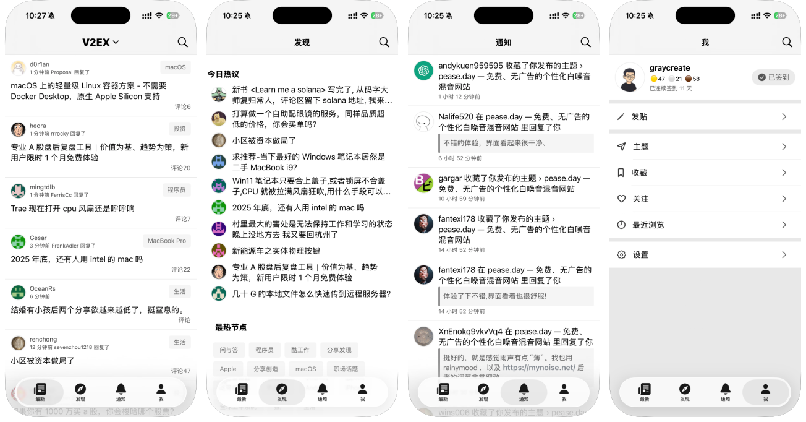

# V2er

A beautiful V2EX client built with SwiftUI for iOS.

## Download

## Preview

## Contributing

Contributions are welcome! You can contribute by:

- **Submitting Pull Requests** - Fix bugs, add features, or improve code
- **Opening Issues** - Report bugs, suggest features, or ask questions

## License

This project is licensed under the GNU General Public License v3. See [LICENSE](./LICENSE) for details.
